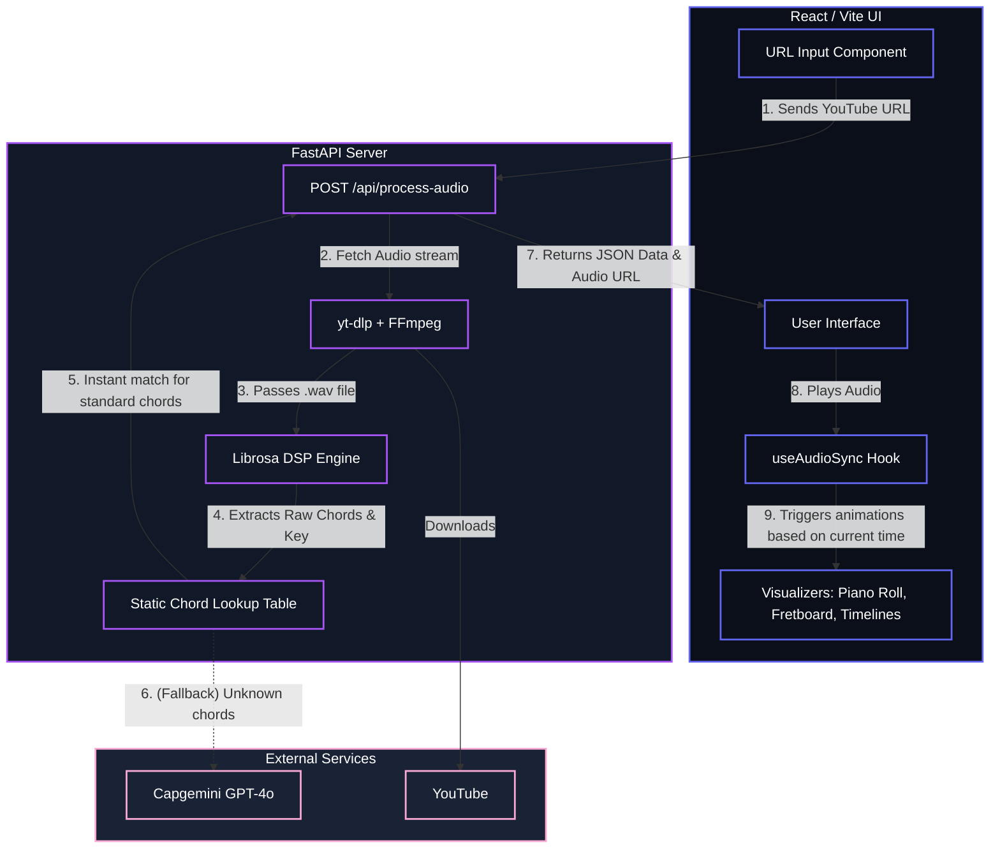

# Keys & Fret (Music Information Retrieval App)
## Overall Architecture & Technology Stack

This document outlines the complete technology stack, libraries, and architectural flow of the **Keys & Fret** music analysis application.

---

## 🛠️ Technology Stack

### 1. Frontend (UI & Visualization)
- **Framework:** React 19
- **Build Tool:** Vite (v8)
- **Language:** TypeScript
- **Styling:** Tailwind CSS v4 + Vanilla CSS (for custom Keyframes/Glassmorphism)
- **Icons:** Lucide React
- **Fonts:** Google Fonts (Inter, JetBrains Mono)

### 2. Backend (API & Audio Processing)
- **Framework:** FastAPI (Python)
- **Server:** Uvicorn (ASGI)
- **Language:** Python 3.x
- **Audio Download:** yt-dlp
- **Audio Conversion:** FFmpeg (v9.0.1)
- **Digital Signal Processing (DSP):** Librosa, NumPy

### 3. Artificial Intelligence (Music Theory Engine)
- **LLM Provider:** Capgemini Generative Engine
- **Model:** `openai.gpt-4o`
- **SDK:** Official `openai` Async Python SDK

---

## 📦 Key Libraries & Dependencies

### Frontend Dependencies (`package.json`)
- `react` / `react-dom` - Core UI rendering
- `tailwindcss` / `@tailwindcss/postcss` - Utility-first styling engine
- `lucide-react` - Scalable vector icons
- `typescript` - Strict typing for UI components

### Backend Dependencies (`requirements.txt`)
- `fastapi` - High-performance web framework for the API
- `uvicorn` - Server to run FastAPI
- `yt-dlp` - Downloads YouTube videos and extracts raw audio
- `librosa` - Advanced music and audio analysis (chromagrams, DSP)
- `numpy` - Fast array operations (used for chord template correlation windowing)
- `openai` - Client to connect to the Capgemini Generative Engine API

---

## 🏗️ System Architecture

The application operates entirely on `localhost` following a client-server architecture. The frontend handles real-time audio playback and dynamic visual syncing, while the backend orchestrates the heavy lifting of downloading, DSP analysis, and AI translation.

---

## ⚙️ How the Pipeline Works (Step-by-Step)

### Phase 1: Ingestion
1. The user pastes a YouTube URL into the frontend UI and clicks **Analyze**.
2. The React frontend sends a `POST` request with the URL to the FastAPI backend.
3. The backend uses **yt-dlp** and **FFmpeg** to download the best available audio stream and convert it into a standard `.wav` file, saved locally in `backend/data/audio/`.

### Phase 2: Digital Signal Processing (DSP)
1. **Librosa** loads the `.wav` file (downsampled to 11025Hz and converted to mono for extreme speed optimization).
2. A Short-Time Fourier Transform (STFT) Chromagram is generated to analyze the pitch classes present in the audio.
3. The dominant musical key is determined by summing the chromagram intensities across the entire track.
4. The audio is chopped into fixed 2-second windows. Using **NumPy**, the pitch data for each window is correlated against 24 perfect chord templates (12 Major, 12 Minor) using mathematical dot products to find the closest match.
5. This produces a raw timeline of timestamps and chord names (e.g., `[0.0s: C Maj, 2.0s: G Maj...]`).

### Phase 3: AI Translation (Keys & Fret Mapping)
1. The backend gathers all *unique* chords found by the DSP engine.
2. First, it checks a **Static Local Lookup Table**. Since 99% of pop music uses standard Major/Minor triads, this step is practically instant (zero network latency) and maps raw chords to Easy Chords (e.g., `C`), Guitar Tabs (e.g., `X32010`), and Piano Keys (e.g., `C-E-G`).
3. If a strange or unknown chord is detected that isn't in the local table, it acts as a graceful fallback and prompts the **Capgemini Generative Engine (GPT-4o)** via the OpenAI SDK to translate the complex chord on the fly.

### Phase 4: Visualization
1. The backend packages the key, chord timeline, translations, and the local `.wav` file URL into a JSON response and sends it to the frontend.
2. The user clicks **Play** on the frontend audio player.
3. A custom React hook (`useAudioSync.ts`) uses a highly efficient `requestAnimationFrame` loop and a Binary Search (`O(log n)`) algorithm to constantly check the HTML5 Audio `currentTime` against the chord timeline.
4. As the song progresses, the React state updates instantly, triggering **Tailwind v4 CSS animations** (glow pulses, sliding playheads) across the Fretboard, Piano Roll, and scrolling Chord Timeline components.
